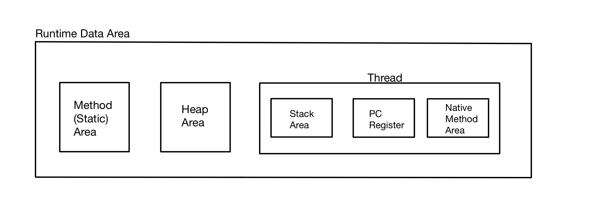

# **변수(class, instance, local)의 종류와 메모리 적재(Stack, Heap, Static)**

{: .bg-purple-000}

---

Java의 변수와 특징을 정리해보자. 기초가 없다면 난 팥빠진 붕어빵이다.

Spring이나 Spring Boot와 같은 프레임워크를 사용할 때 결국은 Java의 클래스 구조를 짜야하기 때문에 기본적인 **변수의 종류**와 **메모리 적재**가 어떻게 이루어 지는지 파악해 놓아야 한다.

{: .note}
변수(혹은 클래스)의 **접근제한자**에 대해서도 기초를 쌓아놓아야 하는데, 이는 나중에 프로그래밍을 할 때 **public**으로만 작성하는 것을 방지하여 메모리 누수 방지, 적절한 디자인 패턴을 사용하기 위함이다.

{: .bg-purple-000}

---

## 클래스 내부에 선언 위치에 따른 변수의 종류

```java
class Variables {
    int inv; // 인스턴스 변수
    static int cv; //클래스 변수(class 변수, 공유 변수)

    void methd() {
        int lv = 0; // 지역 변수
    }
}
```

| 변수의 종류   | 선언위치                                                  | 생성시기                    |
| :------------ | :-------------------------------------------------------- | :-------------------------- |
| 클래스 변수   | 클래스 영역                                               | 클래스가 메모리에 올라갈 때 |
| 인스턴스 변수 | 클래스 영역                                               | 인스턴스가 생성되었을 때    |
| 지역 변수     | 클래스 영역 이외의 영역(메서드, 생성자, 초기화 블럭 내부) | 변수 선언문이 수행되었을 때 |

라고 하는데, **클래스가 메모리에 올라갈 때** 라는 것은 언제일까?

여기서 지나쳐 버린다면 난 슈크림빠진 붕어빵이다.

그러니까 흐름에 따라 클래스를 만들고 생성시키면 메모리에 어떻게 올라가는지 확인해보자.

{: .bg-purple-000}

---

## JVM의 동작 방식

JVM의 동작 방식을 간략화하면 다음과 같다.

1. Java로 개발된 프로그램을 실행하면 JVM은 OS로부터 메모리를 할당한다.
2. 자바 컴파일러인 javac가 자바 소스코드(.java)를 자바 바이트코드(.class)로 컴파일한다.
3. Class Loader를 통해 JVM Runtime Data Area로 로딩한다.
   {: .text-red-000}

4. Runtime Data Area에 로딩 된 .class 들은 Excution Engine을 통해 해석한다.
5. 해석된 바이트 코드는 Runtime Data Area의 각 영역에 배치되어 수행하며 이 과정에서 Execution Engine에 의해 GC의 작동과 스레드 동기화가 이루어진다.

이 때 3번의 **Runtime Data Area(런타임 데이터 영역)**, 즉 JVM의 메모리 영역으로 자바 애플리케이션을 실행할 때 사용되는 데이터들을 적재하는 영역이다.



{: .important}

> 가장 왼쪽에 있는 Method Aread와 Heap Area는 모든 스레드가 공유해서 사용한다.(GC의 대상)
>
> Stack Area, PC Register, Native Method Area는 스레드마다 하나씩 생성된다.

{: .text-red-000}

### Static(Method) 영역

정적이며 불변이고 제거되지 않는다.\
클래스 멤버 변수의 이름, 데이터 타입, 접근 제어자 정보와 같은 각종 필드(속성) 정보들과 메서드 정보, 데이터 타입 정보, static 변수, final class 등이 생성되는 영역이다.

{: .text-red-000}

### Heap 영역

동적이며 변경가능하고 제거 가능하다.\
new 키워드로 생성된 객체와 배열이 생성되는 영역이다.\
주기적으로 GC가 제거하는 영역이다.

{: .text-red-000}

### Stack 영역

동적이며 자동제거된다.\
지역변수, 파라미터, 리턴 값, 연산에 사용되는 임시 값 등이 생성되는 영역이다.

{: .bg-purple-000}

---

## 요약

| 변수의 종류   | 선언위치                                                  | 생성시기                    | 생성 위치           |
| :------------ | :-------------------------------------------------------- | :-------------------------- | :------------------ |
| 클래스 변수   | 클래스 영역                                               | 클래스가 메모리에 올라갈 때 | 클래스(Static) 영역 |
| 인스턴스 변수 | 클래스 영역                                               | 인스턴스가 생성되었을 때    | Heap 영역           |
| 지역 변수     | 클래스 영역 이외의 영역(메서드, 생성자, 초기화 블럭 내부) | 변수 선언문이 수행되었을 때 | Stack 영역          |
